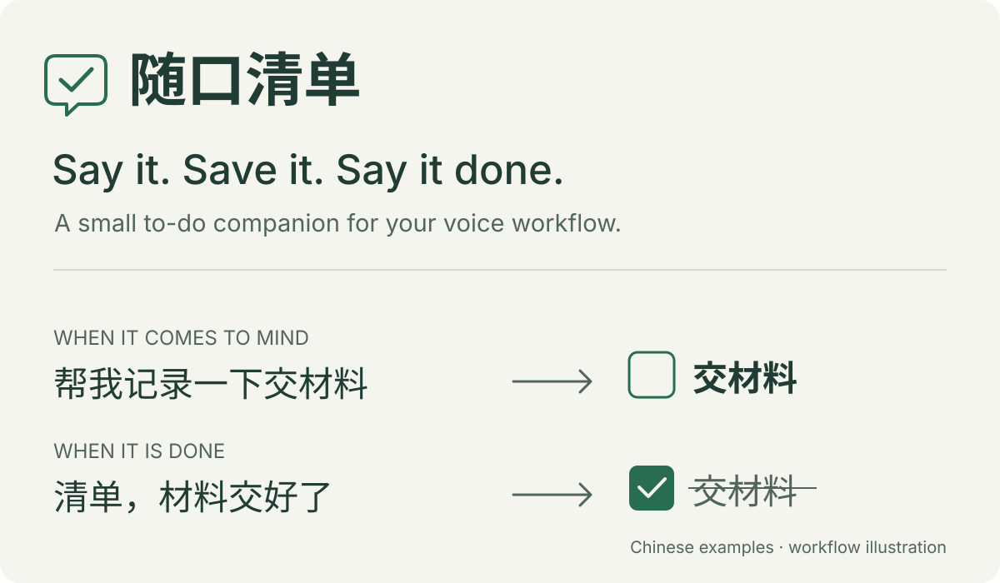

# 随口清单 · Voice Todo

[简体中文](README.zh-CN.md) · [Usage guide (中文)](docs/USAGE.md)

## What it is

A small macOS menu-bar app for turning spoken Chinese into to-dos—and marking them done by speaking again. It keeps a local list, understands dates, sets one-time reminders when requested, and lets you undo an action.

**Current source version: 0.1.1 / build33, in development.** macOS 26 only; Windows and Linux clients are not available yet, and there is no notarized download. Receiving transcripts from other voice tools is experimental.



## How to use it

### Build and open

You need macOS 26 and the full Xcode 26 / Swift 6.2 toolchain. Local voice recognition also needs a supported device with the Simplified Chinese SpeechAnalyzer model installed.

```sh
git clone https://github.com/wangyuqin378-cpu/voice-todo.git
cd voice-todo
zsh scripts/build-app.sh
open 'dist/随口清单.app'
```

The script creates a local development signature; it does not produce a notarized public release. See [build and signing details (中文)](docs/DEVELOPMENT.md) if Xcode is installed elsewhere.

### Try one task

1. Open settings and allow Input Monitoring and Microphone for the default **Fn · local recognition** mode. Allow notifications if you want reminders.
2. Tap Fn to start, say **“提醒我明天下午三点面试。”**, then tap Fn to finish. Holding and releasing Fn is also supported; Esc cancels.
3. Check that **面试** appears with tomorrow at 15:00 as the event time and, with the default ten-minute lead, 14:50 as the reminder.
4. Say **“面试完成了。”** to complete a uniquely matching task, or **“撤销。”** to undo. You can also enter text or manage tasks from the menu-bar list.

**No fixed opening phrase.** Personal plans, reminder requests (including at the end of a sentence), completion and cancellation can be spoken naturally: “明天下午三点面试”, “我10月1号要买车票，提醒我一下”, or “材料交好了”. Ordinary chat stays quiet; uncertain language may need clarification or manual review.

These are example commands, not a claim that every voice setup passes. Text-to-action tests exist; real microphone use, coexistence with other voice software and actual notification delivery still need device acceptance. If capture fails, use text input and check the [usage guide (中文)](docs/USAGE.md).

**AI is optional.** Simple reminders, exact completion/cancellation and supported multi-item inputs run locally, without reading a key or waiting for the network. Only wording the local rules cannot safely handle goes to your configured AI service. Each AI request has an eight-second total deadline and a Stop waiting button; late responses cannot change the list. Unresolved text stays in the recovery list, where you can edit it or add tasks manually. AI requests include the current text, task titles, dates, completion states and follow-up context. The app neither stores nor uploads raw audio. Keys use macOS Keychain and are not bundled with the app. [Data details (中文)](docs/USAGE.md#数据与备份).

## Why this project exists

Remembering a task often happens while doing something else. Opening another app, finding a form and organizing the entry can interrupt that moment. Finishing a task should be just as easy to record as creating it.

The aim is to attach this small workflow to a voice-input habit you already have: say what needs doing, then say when it is done. The default Fn mode uses the app's own local speech recognition. Direct transcript reception from tools such as Typeless remains an experiment, with no official integration or compatibility certification.

Simple tasks run locally; only unresolved wording needs AI. Build33 checks for hypothetical plans and requests for advice: “如果我想住两天水屋呢，再帮我安排一下” stays quiet, while “我明天入住酒店” can still become a task. Both capture and mutation validation inspect the whole utterance so a model cannot save a fragment stripped of its condition. Claude Messages and OpenAI-compatible Chat Completions remain supported, without requiring a Flash model or a fixed opening phrase. AI does not guarantee perfect accuracy.

[Product direction](docs/PRODUCT.md) · [Validation and remaining device checks](docs/REVIEW-BUILD33.md) · [Report an issue](https://github.com/wangyuqin378-cpu/voice-todo/issues)

**License:** source is public; an open-source license has not been specified.
